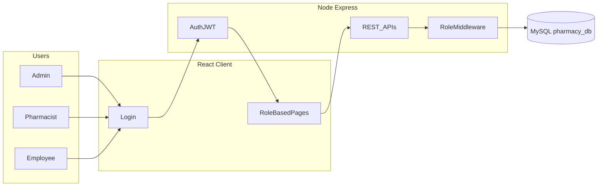
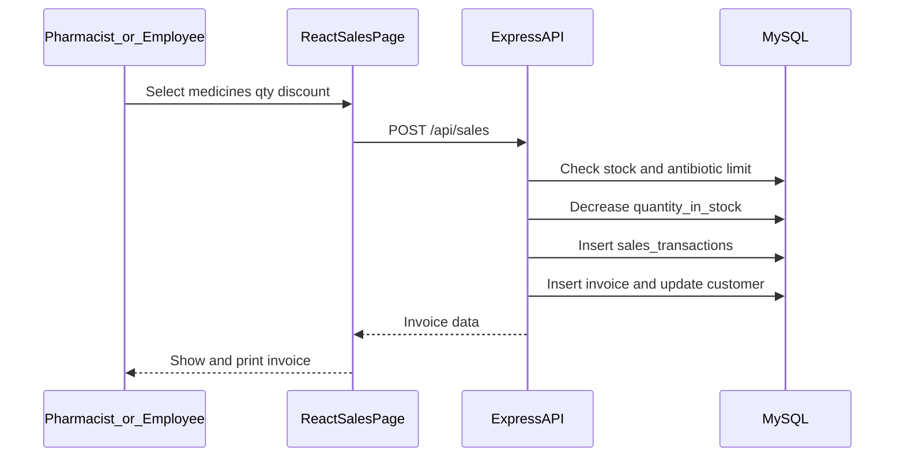

# Khan Pharmacy — React + Node.js + MySQL Full Plan

## Goal

তোমার hand-drawn **Level 0 / Level 1 DFD** আর existing HTML prototype অনুযায়ী একটি **beginner-level** pharmacy system বানানো হবে যেখানে:

- UI দেখতে বর্তমান মতোই থাকবে (নীল sidebar, table, modal, badges)
- কিন্তু প্রতিটা button/action **আসলে MySQL-এ data লিখবে/পড়বে**
- Admin / Pharmacist / Employee আলাদা permission পাবে

PHP বাদ দিয়ে নতুন stack: **React (Vite) + Express (Node) + MySQL**।

---

## Current vs Target

| এখন আছে | নতুন হবে |
|---------|----------|
| Static HTML pages + mock data | React pages + real API |
| PHP thin GET API | Express REST API (full CRUD) |
| Fake login (খালি form) | Real login + JWT + role check |
| Buttons কাজ করে না | সব Add/Edit/Delete/Sell কাজ করবে |

**রাখা হবে:** [`database/pharmacy.sql`](database/pharmacy.sql) schema (ছোট fix সহ), [`css/medicine.css`](css/medicine.css) এর blue sidebar / table look, [`html/*.html`](html) এর page list ও layout।

---

## Project Structure (simple monorepo)

```
Khan Pharmacy/
├── client/                 # React (Vite)
│   ├── src/
│   │   ├── pages/          # Login, Dashboard, Users, Medicines, ...
│   │   ├── components/     # Sidebar, Modal, Table, AlertBanner
│   │   ├── context/        # AuthContext (user + role)
│   │   ├── api/            # fetch helpers
│   │   └── App.jsx
│   └── package.json
├── server/                 # Node + Express
│   ├── src/
│   │   ├── routes/         # auth, users, medicines, sales, ...
│   │   ├── middleware/     # auth.js, roleCheck.js
│   │   ├── db.js           # mysql2 connection
│   │   └── index.js
│   └── package.json
├── database/
│   └── pharmacy.sql        # schema + seed (updated)
└── README.md               # setup steps (XAMPP + npm)
```

Beginner-friendly: দুইটা folder (`client`, `server`), অতিরিক্ত complexity (TypeScript, Redux, Docker) নেই।

---

## Architecture (DFD → Code)



### Role access (DFD অনুযায়ী)

| Module | Admin | Pharmacist | Employee |
|--------|:-----:|:----------:|:--------:|
| Login / Dashboard | yes | yes | yes (limited cards) |
| Users + Salaries | yes | no | no |
| Medicines / Suppliers | yes | yes | view only / no |
| Stock adjustment | yes | yes | no |
| Antibiotic list | yes | yes | no |
| Expiry / Low-stock alerts | yes | yes | no |
| Sales + Billing + Invoice | yes | yes | yes |
| Customers | yes | yes | yes |
| Sales / P&L Reports | yes | view sales | no |

Sidebar menu **role অনুযায়ী** hide/show হবে (এখন সব page-এ একই nav আছে — সেটা ঠিক করা হবে)।

---

## Database (keep + small fixes)

Base: [`database/pharmacy.sql`](database/pharmacy.sql)

**Fixes / small upgrades (beginner-safe):**

1. Seed antibiotic `alert_status = 'Low'` → `'Critical'` (ENUM mismatch fix)
2. Passwords seed-এ **bcrypt hash** (plain `admin123` থাকবে না)
3. Medicines-এ `purchase_price DECIMAL(10,2)` যোগ — যাতে Daily/Monthly **Profit/Loss** হিসাব করা যায়
4. Low-stock threshold: simple constant (যেমন stock &lt; 20 = alert) — আলাদা settings table লাগবে না
5. Expiry alert: `expiry_date` আগামী 30 দিনের মধ্যে হলে alert

Tables থাকবে: `users`, `suppliers`, `medicines`, `antibiotic_list`, `stock_inventory`, `sales_transactions`, `sales_reports` (optional cache / বা auto-compute), `employee_salaries`, `customers`, `invoices`।

**Core business rules (functional heart):**

- **Stock adjust:** `medicines.quantity_in_stock` update + `stock_inventory` log
- **Sell / Bill:** stock কমাবে → `sales_transactions` insert → `invoices` তৈরি → antibiotic হলে `allowed_range_limit` check
- **Alerts:** API থেকে live calculate (low stock + near expiry)
- **Reports:** `sales_transactions` + `purchase_price` থেকে Daily/Monthly sales ও P&amp;L auto generate (Admin)

---

## Backend Plan (`server/`)

**Stack:** Express, `mysql2`, `bcryptjs`, `jsonwebtoken`, `cors`, `dotenv`

### Auth
- `POST /api/auth/login` — username/password → JWT `{ user_id, name, role }`
- Middleware: token verify + `requireRole('Admin'|'Pharmacist'|...)`

### APIs (CRUD, beginner REST style)

| Route group | Main actions |
|-------------|--------------|
| `/api/users` | list/add/edit/delete (Admin) |
| `/api/salaries` | list/add/edit/delete (Admin) |
| `/api/suppliers` | full CRUD (Admin, Pharmacist) |
| `/api/medicines` | full CRUD + stock fields |
| `/api/inventory` | stock adjust log + history |
| `/api/antibiotics` | list/add/update limits & alerts |
| `/api/sales` | create sale (billing), list sales |
| `/api/invoices` | create from sale, list, get one (print) |
| `/api/customers` | CRUD + purchase history update on sale |
| `/api/reports` | daily/monthly sales + profit-loss |
| `/api/alerts` | low-stock + expiry list for dashboard |

Sales create একটা **transaction** এ হবে (stock + sale + invoice) যাতে data inconsistent না হয়।

---

## Frontend Plan (`client/`)

**Stack:** Vite + React + React Router (CSS modules বা একটা `App.css` — existing blue theme copy)

### UI = existing layout রাখা

- Left **blue sidebar** (250px) — [`css/medicine.css`](css/medicine.css) থেকে colors/spacing নকল
- Top bar: page title + green **+ Add** button
- Content: white table, blue header, role/category badges, Edit (amber) / Delete (red)
- Modal for Add/Edit (reports.html-এর pattern)

Pages (existing HTML → React):

1. `Login` — real API
2. `Dashboard` — live counts + alert banners
3. `Users`, `Salaries` — Admin
4. `Medicines`, `Suppliers`, `Inventory`, `Antibiotics`
5. `Sales` (billing form: medicine select, qty, discount %, payment → invoice)
6. `Invoices` — list + print view
7. `Customers`
8. `Reports` — Daily/Monthly view + print

Shared: `AppLayout`, `ProtectedRoute`, `Modal`, `DataTable`, `AlertBanner`.

---

## Implementation Phases (beginner order)

### Phase 1 — Foundation
- Folder setup (`client` + `server`)
- MySQL import + schema fixes
- DB connection, Express hello, CORS
- Login + JWT + role-based sidebar

### Phase 2 — Master data
- Users, Suppliers, Medicines CRUD
- Dashboard live stats

### Phase 3 — Stock & alerts
- Stock adjustment
- Antibiotic list + sale limit check
- Low-stock + expiry alerts on Dashboard

### Phase 4 — Billing (most important flow)
- Sales form (POS-simple: 1+ medicines cart)
- Stock decrease + invoice + customer link
- Invoice list/print

### Phase 5 — HR & Reports
- Salaries CRUD (Admin)
- Daily/Monthly sales & P&amp;L from real transactions

### Phase 6 — Polish
- Role menu hiding
- Empty/error messages
- README: XAMPP MySQL + `npm install` + run instructions
- Seed login: `admin/admin123`, `rafiq/pharma123`, `tariq/emp123`

---

## Key billing flow (must work perfectly)



---

## What we will NOT over-engineer (beginner scope)

- No Redux / TypeScript / Docker
- No email/SMS real notifications (UI alert banner যথেষ্ট)
- No multi-branch / barcode / online payment gateway
- No separate discount-rules engine (discount % প্রতি bill-এ)
- Old `php/` ও static `html/` reference হিসেবে রাখা যাবে; app চলবে `client` + `server` থেকে

---

## Success criteria

1. তিন role দিয়ে login হয়, wrong password fail হয়
2. Employee শুধু billing/invoice/customer দেখে
3. Pharmacist medicine/stock/antibiotic/sales চালাতে পারে
4. Admin সব module + salary + reports পায়
5. Sale করলে stock কমে, invoice তৈরি হয়
6. Low stock / near expiry Dashboard-এ দেখা যায়
7. Daily/Monthly report real sales থেকে আসে
8. UI দেখতে existing prototype-এর মতো (blue sidebar app)